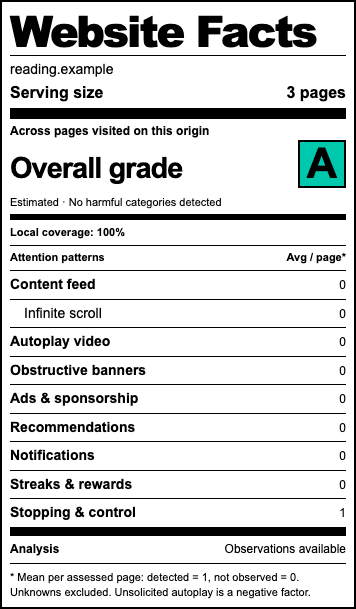
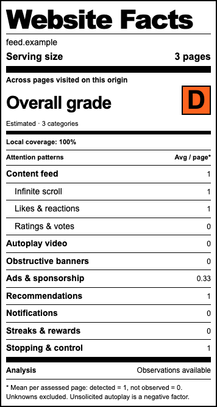
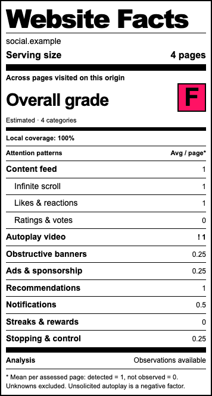

# Nutrition Label

**Idea and research foundation: Vlada Bortnik's articles.** Her writing inspired this project's nutrition-label concept, attention-pattern research and A–F grading:

- [Good for you social tech can also be good for business](https://www.linkedin.com/pulse/good-you-social-tech-can-also-business-vlada-bortnik-she-her--xenrc/) — July 30, 2024; the proposal to make technology's effects visible through nutrition-style labels.
- [We’ve been talking about Big Tech’s “Big Tobacco” moment for years. Let’s do something about it.](https://www.linkedin.com/pulse/weve-been-talking-big-techs-tobacco-moment-years-lets-vlada-jpt2c) — October 28, 2024; the four categories and A–F scale used here.

Our [detection research](docs/detection-research.md) translates those ideas into browser observations and optional AI classification. The extension shows how the pages you visit compete for your attention.

## Example labels

Three illustrations using the real popup and synthetic observations on fictional sites. Click a label to enlarge it.

<table>
  <tr>
    <th>Calm reading</th>
    <th>Recommended feed</th>
    <th>All four categories</th>
  </tr>
  <tr>
    <td valign="top"><a href="docs/examples/calm-reading.png"></a></td>
    <td valign="top"><a href="docs/examples/recommended-feed.png"></a></td>
    <td valign="top"><a href="docs/examples/all-four-categories.png"></a></td>
  </tr>
  <tr>
    <td><strong>A</strong> — no harmful categories observed</td>
    <td><strong>D</strong> — three categories observed</td>
    <td><strong>F</strong> — all four categories observed</td>
  </tr>
</table>

Rows show arithmetic means per assessed page; the grade counts distinct categories. Unknown criteria are hidden. [Example data and regeneration](docs/examples/README.md).

## Download and try it

**[Download the Chrome extension (.zip)](https://github.com/romanenko/nutrition-label/releases/latest/download/nutrition-label-chrome.zip)** · [Latest release and notes](https://github.com/romanenko/nutrition-label/releases/latest) · [Install guide](docs/INSTALL.txt)

No build tools or development server required. Local detection works without an API key. Use Chrome 120 or newer on a desktop computer.

1. Download **nutrition-label-chrome.zip** from the release assets and extract it (double-click on macOS; **Extract All** on Windows).
2. Keep the extracted files in a permanent location. Find the **nutrition-label** folder containing `manifest.json`; `INSTALL.txt` sits beside it.
3. Enter `chrome://extensions` in Chrome's address bar and turn on **Developer mode**.
4. Click **Load unpacked** and select that **nutrition-label** folder.
5. Pin **Nutrition Label** using Chrome's puzzle-piece menu. Visit a website and click the icon. Browse normally and reopen the popup to see updated observations.

Enable **Assess this site as I browse** to track more pages on that origin. Add your own Jev key through **Jev & settings** only if you want AI classification. Unknown criteria remain hidden; the grade is an estimate from the observed sample.

The repository and downloads are public, and the project is tagged [Punk Software](https://github.com/topics/punksoftware). The ZIP is self-contained and includes no API key or browsing data. This is an unpacked preview, not a Chrome Web Store installation; updates are manual. Choose the extension ZIP asset, not GitHub's **Source code** archives.

## Version 0.2

The **Website Facts** popup collects real observations. It combines local DOM and behavior measurements with optional text-only Jev classification using your own API key.

| Criterion | Implemented method |
| --- | --- |
| Content feed | Explicit feed semantics; repeated article/card candidates; Jev classification of ambiguous structure. |
| Infinite scroll | New item identities after a near-end scroll, without a recent Load more action. No feed in a complete scan counts as not observed. |
| Likes, hearts, reactions | Named interactive controls within feed candidates. |
| Stars, ratings, votes | Named interactive rating/vote controls within feed candidates. |
| Political topics, hateful language, provocative framing | Three independent Jev questions for sampled visible feed items; requires separate feed-text opt-in. |
| Autoplay video | Starts without a matching recent play action. Muted starts count; already-playing video and autoplay attributes alone remain unknown. No video elements in a complete scan counts as not observed. |
| Obstructive banners | Large visible fixed/sticky panels and dialogs, with approximate viewport obstruction. |
| Ads and sponsorship | Visible ad/sponsorship labels. |
| Deceptive prompts | Jev classifies wording from candidate prompts and action labels. |
| Recommendations, streaks/rewards | Visible wording rules. |
| Notifications | Request wording or a visible unread count on a named Notifications/Activity/Alerts control. |
| Stopping points and controls | Pagination, Load more, caught-up, ordering and autoplay-control wording. |

**Overall grades use Vlada's A–F scale:** A = 0 categories, B = 1, C = 2, D = 3, F = all 4. There is no E. The grade counts distinct categories indicated anywhere in the current origin assessment, using these observable proxies:

| Article category | Signals counted by this extension |
| --- | --- |
| Attention monetization | Ads or sponsorship labels |
| Personalized ranking | Recommendation wording |
| Persistent notifications | Notification request wording or an unread notification/activity badge; frequency and push delivery remain unverified |
| Infinite engagement | Infinite scroll, unsolicited autoplay, or streaks/rewards; together they count once |

The grade is an **estimate**: these signals do not verify a company's business model, its ranking algorithm or notification persistence. **A rewards an analyzed page with no harmful categories detected.** A readable page with no feed or video can earn A immediately, without Jev. If a feed, video or embedded frame remains unassessed, the label shows **Provisional A** while keeping those findings unknown. Blank, loading, failed or truncated scans without usable evidence stay ungraded. Grades can worsen as more categories are observed; positive controls do not cancel detected harms. Inspection details show the four contributions and link to the article. Grades describe the observed sample, not proof that an entire website is harmless. No weights or probability averaging are used for the letter grade.

Other criteria remain descriptive and do not add grade penalties. A feed or political topic alone does not reduce the grade. Observed unsolicited autoplay contributes to the infinite-engagement category. Model probability is experimental, not a calibrated accuracy, severity or harm score. Findings use a 90% positive threshold, results at 10% or below can count as not observed, and the middle remains unknown. A written AI explanation is not required.

### Serving size and coverage

Serving size counts distinct pages visited while observation is active on the exact origin (scheme, host and port). Reloads and revisits update the same page. Known tracking parameters and ordinary anchors are ignored; meaningful queries and hash-router paths are retained. Raw paths are stored only as device-keyed digests.

The label shows the **arithmetic mean per assessed page** as a number: a detection is 1 and an assessed non-detection is 0 (1 of 3 becomes 0.33; 3 of 3 becomes 1). Values are rounded to at most two decimal places. This measures presence, not the number of individual ads, reactions or videos. Unknown pages are excluded from that criterion's denominator. Criteria that remain entirely unknown are hidden; assessed criteria with zero detections stay visible. Inspection details retain exact page counts, Jev probabilities and coverage gaps. Local coverage remains the percentage of visited pages with a collected DOM snapshot, not a measure of whether every criterion was resolved. Positive findings remain in that page's sample until reset, even if a banner disappears or playback stops. This is an accumulating observation record, not a live absence guarantee or an assessment of the entire website.

## Local development with hot reload

Use Node.js 24 (or 22.12+) and npm. With `fnm`, run `fnm use` in this folder.

```sh
npm install
npm run dev
```

Keep the terminal running. Vite and CRXJS build into `dist/dev` as you edit `extension/`.

1. Open `chrome://extensions` and enable **Developer mode**.
2. Choose **Load unpacked** and select your checkout's `dist/dev` folder. On macOS, use **Command + Shift + G** in the picker to paste its full path.
3. Disable any older copy loaded from `extension/` or `dist/release`. Pin **Nutrition Label (Dev)**.
4. Open a regular website and click the extension. It begins a two-minute observation window. Scroll and use the page normally, then reopen the popup to see findings.
5. Enable **Assess this site as I browse** to collect on future visits and route changes. Chrome asks for that site's access and navigation permission. Other origins need their own opt-in.

If you already have the extension loaded, **reload it once on `chrome://extensions` after this upgrade**, then reload the website tab so the updated collector runs.

- **Layout preview:** [http://127.0.0.1:5173/popup.html](http://127.0.0.1:5173/popup.html). Updates on save; Chrome extension APIs are unavailable here. Settings preview disables credential entry.
- **Real extension:** CSS updates live; JavaScript/HTML changes refresh the popup. Reopen it if Chrome closes it. Background/manifest changes can reload the whole extension; refresh the inspected page to replace its collector.
- **After restarting:** run `npm run dev` and reload the extension if it is not reconnecting. Session keys are cleared by an extension reload; saved encrypted keys must be unlocked again.

The server uses port 5173 and fails if it is occupied, rather than selecting a different port.

### Standalone build

```sh
npm run build
```

Load `dist/release` as an unpacked extension. It needs no development server. Building does not overwrite `dist/dev`. Local detection works without a Jev key.

To create the downloadable package, use Python 3 in addition to Node:

```sh
npm run package
```

This rebuilds the release and writes `dist/downloads/nutrition-label-chrome.zip` plus its SHA-256 checksum. The archive contains the standalone extension, installation instructions and bundled dependency notices. It never copies browser storage, development output or local test artifacts. Upload these files to a versioned GitHub release; keep the asset name stable so the README download link points to the latest version.

## Jev settings

Open **Jev & settings** beneath the label, or the extension's **Options** from Chrome's extension menu.

1. Paste your TypeSafe API key into the installed extension's settings.
2. Choose **For this browser session**, or **Encrypted on this device** with a passphrase of 12–256 characters.
3. Save. This makes no API request. **Test connection** optionally sends a small synthetic request using your API credits.
4. Enable **Use Jev for classification** and save analysis preferences. Chrome requests access to `api.typesafe.ai`.
5. Enable **Include sampled feed text** separately for political topics, hateful language and provocative framing.

Calls go directly from the extension worker to the fixed TypeSafe endpoint using `jev-1.13.0`. Up to 12 visible feed items and a few candidate prompt/structure records are sent per batch. Text is bounded and common links, emails, long numbers and credential-like strings are redacted. Recognized private-message paths, password forms and chat logs suppress text upload. These are heuristics, not a guarantee that public or personalized page text contains no personal information; enable feed-text analysis only for pages you want to share with TypeSafe.

The worker limits automatic classification to 3 batches per page and 60 total per hour in a browser session. Unchanged input is cached; changed input may require another batch. Local measurements continue when the key is locked, the service fails or a request limit is reached. No request is made just by saving a key.

### Storage and privacy

- Session keys stay in restricted `chrome.storage.session`. Persistent keys use AES-256-GCM encryption with a fresh salt/IV and a PBKDF2-SHA-256 passphrase key (600,000 iterations). The passphrase is not stored.
- Both storage areas exclude content scripts. Only trusted extension pages can issue credential commands; no message returns the key. The inspected website never receives it.
- **Lock** clears the unlocked session and aborts requests. **Forget key** removes stored copies; revoke at TypeSafe to invalidate the provider credential.
- Page text is transient. Local records contain origin names, keyed page digests, dates, findings, probabilities, coverage and versions. Origins and findings can still reveal browsing interests. Nothing is synced to your Google account.
- **Reset this site** or **Clear all assessments & stop following** deletes observations independently of your key. History is capped at 1,000 pages and a conservative storage limit; collection pauses when full instead of silently dropping pages.
- Incognito assessment is disabled. There is no analytics backend. A compromised extension or device can access an unlocked key; passphrase encryption protects the locked saved copy.

Chrome host grants cover a scheme/host across ports. The worker still enforces exact-origin opt-in before accepting observations. Turning off following stops collection but retains Chrome's host permission; revoke that grant in Chrome's extension settings if desired.

## Testing

```sh
npm test
npm run build
```

Tests cover encrypted storage and failure states, content-script authorization, navigation/page identity, reset and late responses, input bounds, redaction, uncertainty, mocked Jev transport, all five grade boundaries, category deduplication, positive and provisional A grades, incomplete grading coverage, and notification badge positives/false positives. They require no API key and make no paid requests.

For manual checks, visit [the local fixture](http://127.0.0.1:5173/fixture.html?page=one) while Vite runs. This synthetic page is excluded from the release build. Avoid editing source during a navigation test because hot reload resets the fixture.

1. Open the extension: feed, reaction/rating controls and visible sponsorship/prompt wording should be found. Jev-only rows remain unknown and hidden with AI off.
2. Scroll inside the bordered feed to its end. New items arrive; infinite scroll should become detected.
3. Click **Play video**: this is user-started playback. Pause, wait at least three seconds, then click **Schedule video**: the unsolicited muted start should be detected as a negative factor.
4. Enable site following; visit **Page two**, then **SPA route**. Serving size becomes three. Reload or revisit; the count stays three.
5. Try an unrelated origin: it has a separate assessment. Reset the fixture site: its saved findings disappear and following stops.
6. Use a dummy key to exercise encrypted Save, Lock, wrong-passphrase rejection, Unlock and Forget. Do not test a dummy key against the provider.
7. Open `chrome://extensions` and the localhost layout preview: neither should produce a fabricated page assessment or accept a real API key in the preview.
8. Visit `fixture.html?page=one&badges=1`. The notification permission prompt is hidden. **Toggle unread badge** adds/removes the visible Activity count; an empty control should not produce a notification finding. Reset the fixture assessment between positive/negative checks because detections persist once observed.

Verified in Chrome with the synthetic fixture: local feed/reaction/rating detection, infinite scroll, user-started versus unsolicited muted video, origin counting through full and SPA navigation, reload deduplication, restricted content-script storage, and the encrypted-key lifecycle. A user-provided key also passed the live connection test and returned classifications for synthetic feed text. Browser checks on a synthetic fixture validate mechanics, not real-world detection accuracy; representative Jev evaluation remains future work.

## Current limits and next steps

This is a first detector implementation. It inspects the top document and accessible shadow roots, with a 5,000-element cap and sampling about every 2.5 seconds while visible. It does not inspect iframe contents, perform OCR, transcribe video/audio, reconstruct Chrome's full accessibility tree, analyze network trackers or use maintained ad-blocking lists. Unnamed icons and non-English controls can be missed. Brief events before injection or between samples may be missed. Custom or delayed play controls can be misclassified. Overlay presence does not establish manipulative purpose, and a finite scroll observation cannot prove a feed is endless.

Next: evaluate false positives and Jev thresholds on representative pages, strengthen evidence for the four grading categories, and refine criteria with the user. The broader [detection research](docs/detection-research.md), [origin design](docs/origin-assessments.md) and [key storage design](docs/jev-key-storage.md) include future work beyond this version.

```text
extension/
  background.js    Permissions, assessments, request budgets and credential commands
  collector.js     Local DOM, accessible-name and behavior observations
  lib/             Rules, identity/aggregation, Jev client and encrypted vault
  popup.*          Nutrition-style label
  options.*        Keys, privacy preferences and assessment management
  fixture.html     Local synthetic detector test page
tests/             Unit and worker integration tests
vite.config.js     Development and standalone packaging
dist/              Generated builds (gitignored)
```
