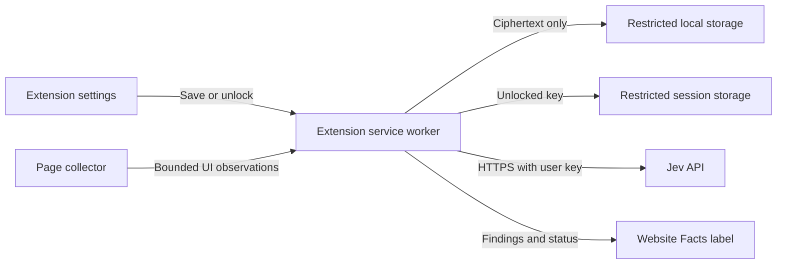

# User-provided Jev keys

Design date: September 24, 2026. Proposed mechanism; no credential storage or API integration is implemented yet.

## Decision and user flow

Let each user supply their own Jev API key in a dedicated extension settings page. The extension service worker calls Jev directly. Our application does not need to receive or relay the key through a server.

Offer two choices:

| Choice | User experience | Storage |
| --- | --- | --- |
| Use for this browser session | Paste the key and save. Enter it again after a browser restart or extension reload/update. | Plaintext key in `chrome.storage.session`, restricted to trusted extension contexts. |
| Remember on this device | Paste the key and choose an unlock passphrase. Unlock after a browser restart or extension reload/update. | Encrypted key in `chrome.storage.local`; plaintext only in restricted session storage while unlocked. |

The session option is the default and needs only the API key. Persistent storage requires a passphrase so the secret used to decrypt the key is not saved beside it. There is no extension-only promise of encrypted persistence and unattended unlocking without some separately protected secret.

Settings show **Not configured**, **Available this session**, **Saved and locked**, or **Saved and unlocked**. Include Replace key, Lock, and Forget key actions. Never repopulate an input with the saved key. Use password inputs and clear them after submission; show status rather than the key in the popup.

An optional **Test connection** button sends a tiny synthetic classification request, with a note that it uses Jev credits. Saving alone makes no network request. Do not validate using content from the user's active page. If the passphrase is forgotten, the user replaces the stored key; the extension has no recovery copy.

## What the protection means

Chrome documents that extension storage is not encrypted. Its Storage API provides local persistence and memory-only session storage, plus access controls that exclude content scripts. These controls provide isolation, not encryption of data on disk. [Chrome privacy guidance][privacy] · [Storage API][storage]

This design protects the key from inspected websites and accidental inclusion in page messages, logs or source files. Passphrase encryption also protects a copied credential record while it is locked, subject to passphrase strength. It does not protect an unlocked browser from a compromised extension, malicious extension update, or someone controlling the operating system. JavaScript cannot guarantee erasure of every in-memory copy.

Do not use `chrome.storage.sync`, page `localStorage`, cookies, URL parameters, source-controlled configuration, or Vite environment variables for the key. The normal localhost layout preview must use mock settings and never accept a real key. Credential entry belongs only in the installed extension's settings page.

## Storage layout

| Location | Proposed record | Lifetime |
| --- | --- | --- |
| Restricted `storage.local` | `jevVaultV1`: version, credential revision, KDF settings, random salt, random IV, authenticated ciphertext. | Until replacement, Forget key, or uninstall. Never contains the API key or passphrase in plaintext. |
| Restricted `storage.session` | `jevUnlockedV1`: API key and matching credential revision. | Until Lock, Forget key, extension reload/update/disable, or browser restart. |
| Restricted `storage.local` | Nonsecret preferences: storage mode and selected model. | Ordinary settings lifetime. |
| Service worker request memory | Temporary authorization header, redacted state and validated response. | Request lifetime. Never a log or persistent queue entry. |

On each worker start, initialize both storage areas with `setAccessLevel({ accessLevel: "TRUSTED_CONTEXTS" })`. All credential operations await that initialization and fail closed if it fails. Register event listeners synchronously and await initialization inside handlers. Do this before the first save; restrict local storage even when it currently contains ciphertext only. Session storage already excludes content scripts by default, but set its policy explicitly. [Storage API][storage]

Trusted extension pages can technically access these stores. Routing all reads and writes through a credential module in the worker is an application boundary, not an extra Chrome permission boundary. Do not expose a `getKey` message or forward storage-change events containing secrets.

The persistent vault record can have this shape; placeholders below are descriptive, not usable credentials:

```json
{
  "version": 1,
  "provider": "typesafe",
  "credentialRevision": "random-revision-id",
  "kdf": {
    "name": "PBKDF2",
    "hash": "SHA-256",
    "iterations": 600000,
    "saltB64": "random-16-byte-salt"
  },
  "cipher": {
    "name": "AES-GCM",
    "keyLength": 256,
    "ivB64": "fresh-random-12-byte-IV",
    "tagLength": 128,
    "ciphertextB64": "encrypted-key-with-authentication-tag"
  }
}
```

Use 600,000 PBKDF2-HMAC-SHA-256 iterations for version 1, matching OWASP's current recommendation for that KDF. This choice uses built-in Web Crypto; OWASP generally prefers memory-hard algorithms where available. Benchmark unlock latency on supported devices before release and revisit the versioned policy as guidance changes. Accept only the supported version/algorithm/work-factor combination before deriving a key, rather than trusting arbitrary parameters from storage. A future update must not silently fall back to plaintext storage. [OWASP password-KDF guidance][owasp]

## Encryption and lifecycle

Use the browser's Web Crypto API rather than a custom cipher:

1. Generate a fresh 16-byte salt with `crypto.getRandomValues()` for a newly saved credential.
2. Derive a non-extractable AES-256 key from the user's passphrase using PBKDF2 with SHA-256. Keep the passphrase and derived key in operation-local memory.
3. Encrypt the Jev key with AES-GCM, a fresh 12-byte IV and a 128-bit authentication tag. Authenticate a canonical version/provider/revision header as additional data. Never reuse an IV with the same derived key.
4. Persist the ciphertext envelope only after encryption succeeds. Populate restricted session storage for use during the current browser session.
5. To unlock, derive the key again and authenticate/decrypt. A wrong passphrase or corrupted ciphertext yields the same generic failure and leaves the existing vault intact.

These are supported Web Crypto primitives; their use and nonce requirements are documented by MDN. [Key derivation][derive-key] · [PBKDF2 parameters][pbkdf2] · [AES-GCM parameters][aes-gcm]

Lock removes the session record and aborts active Jev requests. Forget removes both records and resets credential status; it does not revoke the key at TypeSafe. Replacing a key uses a new revision, salt and IV. Invalidate the old session credential before activating the replacement. If any write fails, keep a consistent locked state and explain the failure without displaying secrets.

Serialize credential mutations in the worker. Check the credential revision before starting a request and before accepting its result so a late response cannot restore deleted state. After worker suspension, reload the session credential when needed; worker-global variables are not the source of truth. A worker restart alone should not ask the user to unlock again while session storage still exists.

## Requests and trust boundaries



The Jev request is `POST https://api.typesafe.ai/v1/systemone`, authenticated with an `Authorization: Bearer` header. The key belongs only in that header, never in the model's state or questions. [TypeSafe API][jev-api]

Add `storage` and a service worker when this feature is implemented. Request optional host access to `https://api.typesafe.ai/*` when the user enables Jev. The actual request destination is hardcoded to the endpoint above; a Chrome host permission does not restrict the allowed URL path. Set a release CSP allowing connections only to required endpoints. Chrome permits cross-origin requests from the extension worker with host access. [Extension network requests][network]

Use `credentials: "omit"`, `redirect: "error"`, `cache: "no-store"`, an explicit request timeout, and HTTPS. Do not offer a user- or page-controlled endpoint override that could receive the key. Development reload permissions stay separate from release policy.

Privileged credential commands accept only validated messages from the exact installed extension settings URL and our extension ID. Popup commands may request status or lock; none returns a credential. Do not install external-message handlers or a page-to-worker bridge for credential commands.

Collector messages are untrusted. Validate their schema and size, bind them to the browser-supplied tab/frame/document identity and an active scan or enabled origin, and cap requests. The worker selects the model, questions and destination from its own configuration. The collector cannot supply authorization headers or arbitrary instructions to run. Chrome explicitly advises treating content scripts as less trustworthy than the worker. [Message security][messaging]

Keep page text out of HTML rendering and out of logs. Only redacted candidate UI records go to Jev. Key ownership does not imply consent to upload private page contents: the feature should explain what is sent when enabled, with local-only findings still available.

## Failures and checks before release

Classify invalid-key responses separately from rate limits, service errors and offline failures. A `401` marks the credential as rejected and stops automatic retries; it does not delete the saved vault. Retry eligible transient failures with bounded backoff and request limits. Never show raw request headers or an unfiltered provider error body. [TypeSafe API][jev-api]

Meaningful acceptance checks:

- Inspect persisted data: no plaintext key or passphrase, and no secret in logs, built assets or model state.
- Attempt storage access and credential commands from a content script: deny access, including during worker startup.
- Round-trip a test credential; reject a wrong passphrase, modified ciphertext and unsupported/malicious KDF parameters.
- Suspend/restart the worker: an unlocked session still works. Restart the browser or reload the extension: persistent storage is locked.
- Lock/Forget/Replace during a request: abort work and reject stale results. Test storage failures between lifecycle steps.
- Confirm requests use only the fixed HTTPS endpoint and refuse redirects; verify the localhost preview cannot save credentials.
- Test connection uses a synthetic record; no assessment or paid call occurs merely by opening settings or saving a key.

No live key has been requested, stored or used during this design work.

[privacy]: https://developer.chrome.com/docs/extensions/develop/security-privacy/user-privacy
[storage]: https://developer.chrome.com/docs/extensions/reference/api/storage
[derive-key]: https://developer.mozilla.org/en-US/docs/Web/API/SubtleCrypto/deriveKey
[pbkdf2]: https://developer.mozilla.org/en-US/docs/Web/API/Pbkdf2Params
[aes-gcm]: https://developer.mozilla.org/en-US/docs/Web/API/AesGcmParams
[owasp]: https://cheatsheetseries.owasp.org/cheatsheets/Password_Storage_Cheat_Sheet.html
[network]: https://developer.chrome.com/docs/extensions/develop/concepts/network-requests
[messaging]: https://developer.chrome.com/docs/extensions/develop/concepts/messaging
[jev-api]: https://docs.typesafe.ai/api
